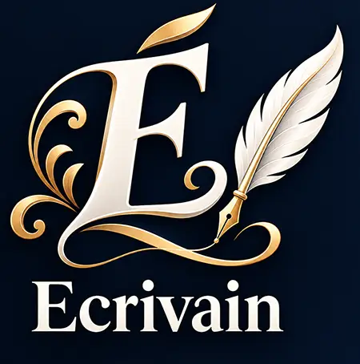

<p align="center">
  
</p>

<h1 align="center">Écrivain</h1>
<p align="center"><strong>Écrire sans usine à gaz.</strong></p>

**Écrivain** est un atelier d’écriture local destiné à celles et ceux qui veulent
écrire sans se perdre dans une interface complexe : chapitres à gauche, texte au
centre, notes et outils narratifs à portée de souris.

Le projet a été **initié par Pantélis Matsos**, d’abord sous forme de module pour
Zwii. Il est aujourd’hui poursuivi par **Stéphane Matsos**, qui en définit l’usage,
l’ergonomie et les besoins d’auteur, avec un développement technique assisté par
intelligence artificielle.

> À la mémoire de Pantélis Matsos, initiateur du projet Écrivain.
>
> **Next Horizon** est conservé comme nom historique du projet d’origine.

## Version actuelle

**Écrivain 0.6.0 bêta — 0.6.0-beta.6**

Cette bêta est destinée à être utilisée sur de vrais projets pendant plusieurs mois.
La priorité n’est plus d’ajouter des fonctions, mais de vérifier la stabilité, le
confort d’écriture et la fiabilité des exports sur la durée.

## Ce qu’Écrivain fait déjà

- chapitres et sous-chapitres, glisser-déposer, statuts et menu contextuel ;
- éditeur riche avec typographie française, tirets cadratins, exposants et caractères invisibles ;
- correcteur orthographique français Hunspell intégré : soulignement, suggestions au clic droit et dictionnaire personnalisé ;
- synopsis global et synoptique ;
- notes, documents, images et pièces jointes conservés avec le projet ;
- chronologie et carte mentale ;
- statistiques ;
- recherche/remplacement dans le chapitre et dans tout le projet ;
- historique avec comparaison de versions ;
- cinq sauvegardes complètes du projet ;
- vérification et récupération silencieuses ;
- exports Markdown, DOCX, ODT, EPUB et PDF ;
- assistant IA : Ollama, LM Studio, OpenAI, Anthropic et Mistral ;
- système d’extensions installables hors ligne (API v2, compatible v1) ;
- système d’extensions remanié avec espace de travail dédié ;
- extension séparée **Correcteur français — Grammalecte 0.2.1**, basée sur le moteur local Grammalecte 2.3.0 ;
- préférences, projets récents, plein écran, zoom et aide intégrée ;
- journal technique et rapport de diagnostic pour la phase bêta.

## Une application locale

Les projets restent sur l’ordinateur de l’utilisateur. Écrivain fonctionne hors ligne
pour l’écriture, les notes, l’organisation et les exports. Une connexion Internet
n’est nécessaire que pour les services explicitement connectés, par exemple une IA
distante.

Les projets sont enregistrés en dehors du programme dans un format documenté :

- format : `ecrivain-project` ;
- version du format : `1` ;
- schéma interne : `1.4.0`.

Voir `FORMAT-PROJET.md`.

## Vos œuvres vous appartiennent

**Écrivain ne revendique aucun droit sur vos manuscrits, notes, images, documents ou
autres contenus.** Vous restez libre de publier et de commercialiser les œuvres
créées ou traitées avec le logiciel.

## Licence du logiciel

Le cœur d’Écrivain est distribué sous **Apache License 2.0 complétée par la Commons
Clause v1.0**. Le code source est disponible pour étude, modification, contribution
et redistribution selon ces conditions, mais Écrivain ou une copie dont la valeur
repose essentiellement sur Écrivain ne peut pas être commercialisé sans autorisation.

Le nom **Écrivain**, son emblème et son identité visuelle sont réservés.

La documentation officielle est publiée séparément sous **CC BY-NC-ND 4.0**.

Voir `LICENSE`, `NOTICE`, `TRADEMARKS.md` et `DOCUMENTATION-LICENSE.txt`.

## Extensions

Les extensions permettent d’ajouter des outils sans modifier le cœur d’Écrivain.
Une extension tierce peut choisir sa propre licence. L’API v2 ajoute des ressources privées
permettant d’embarquer proprement des moteurs JavaScript et leurs données tout en gardant
le manuscrit protégé. La compatibilité avec l’API v1 est conservée.

Une préversion de l’interface **Correcteur français — Grammalecte** est fournie dans
`extensions-exemples/`. Elle permet déjà de tester l’ergonomie et une pré-analyse
typographique locale. Le véritable moteur Grammalecte GPL n’est pas encore embarqué.

Voir `EXTENSIONS.md`.

## Démarrer en développement

Prérequis : **Node.js 24 LTS**.

```powershell
npm.cmd install
npm.cmd start
```

Sous Windows, `LANCER-ECRIVAIN.cmd` lance directement l’application lorsque les
dépendances sont déjà présentes.

## Construire la version Windows

Le fichier `CONSTRUIRE-WINDOWS.cmd` :

1. installe/vérifie les dépendances ;
2. contrôle la syntaxe du projet ;
3. fabrique l’application Windows x64 ;
4. crée une archive portable ;
5. crée `Ecrivain-Setup-0.6.0-beta.6.exe` si **Inno Setup 6** est installé.

Les sorties sont placées dans `dist/`.

Les scripts `CONSTRUIRE-LINUX.sh` et `CONSTRUIRE-MACOS.sh` préparent les bundles des
autres plateformes. La distribution publique macOS devra ensuite être signée et
notarisée sur macOS.

## Bêta et diagnostic

En cas de problème :

**Aide → Informations techniques → Créer un rapport de diagnostic…**

Le rapport ne contient ni le texte du manuscrit ni les clés API.

Voir `BETA-TEST.md`, `KNOWN-ISSUES.md` et `DIAGNOSTIC.md`.

## Contribuer

Les corrections, améliorations ergonomiques et extensions sont bienvenues. Avant
toute contribution au cœur du logiciel, lire `CONTRIBUTING.md`.

---

**Projet initié par Pantélis Matsos**  
**Conception fonctionnelle et poursuite : Stéphane Matsos**  
**Développement technique : assisté par intelligence artificielle**  
**Next Horizon — projet historique**
